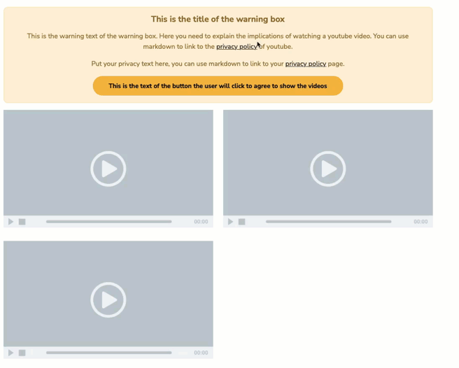

# Hugo Shortcode for embedding videos with a privacy warning

<p align="center">
  
</p>

## Disclaimer about GDPR compliance

This is a personal project for embedding videos on my website in a GDPR
complaint way as I understand it. I am not a solicitor and I am not
knowledgable with the GDPR law. I did not check this project with a solicitor
to see if it is complaint and I only make the assumption that "deferring
embedding of videos until user consents with privacy policy notices" would be
the right way to do this. If you are going to use this for your own personal
project or commercial site please do check with a solicitor for compliance. I
provide no guarantees that this is GDPR complaint in any way.

## Installation

This repo at this point assumes that the site uses bootstrap. It uses bootstrap
CSS to format the warning and the shortcode in general. You can easily change
the formatting if you wish to match the aesthetics of your site.

Add the following lines in your config.toml:

```
[module]
[[module.imports]]
  path = 'github.com/rpapallas/hugo_gdpr_embeds'
```

Make sure that your Hugo site project is a module by running the
following lines:

```
hugo mod init github.com/YOUR_USERNAME/PROJECT_REPO_NAME
go mod tidy
```

## Usage

### YouTube

The way YouTube video embed happens is that the shortcode will pick up
the list of YouTube video IDs and load them into iframes. By default, the
shortcode will append the ID to `https://www.youtube-nocookie.com/embed/` which
defers cookies/tracking until user clicks the play button. To be extra careful,
the iframes are hidden and replaced with placeholder images and the url is
added to the `data-src` attribute of the iframe instead of `src` 
which will cause it not to load automatically on page load. Once the user
consents by clicking on the button of the privacy warning message, the 
shortcode will show the videos and move the URL from `data-src` to `src` that 
will cause the videos to be loaded at that time.


```md
{}
IAqByEb6wfo
tyHdtifvQz8
{}
```


## Contributing

I have currently implemented this for YouTube but it can easily be extended
for other embeds. If you need something else and you spend the time/effort to
implement it, please consider opening a pull request and I would be happy
to merge.

This is also a quick project and there could be space for improvement. If you 
have feedback or want to improve it, please open a PR as well.
